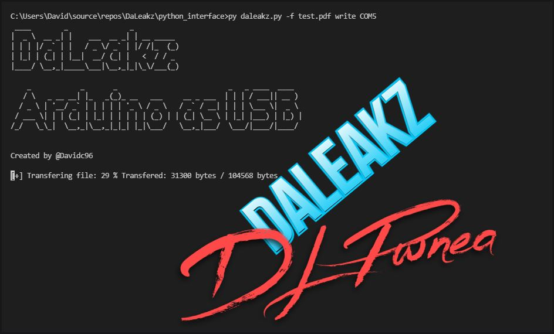

# Daleakz: Data Exfiltration via Serial using Arduino

# Installation

This repository is divided in two parts:
- Arduino C++ Source code which contains all the source code that needs to be loaded into the Arduino
- Python CLI to interact with the Arduino

Every folder contains it's README with the instruction on how to install it.

# Disclaimer

This software is developed for research and educational purpouses, using it to exfiltrate company's data without permission is considered illegal, I'm not responsible for any damaged produced by my software. Use at your own risk.
