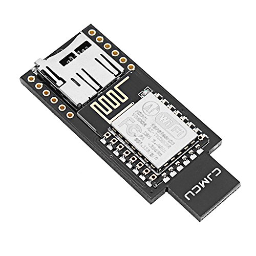

# Daleakz: Arduino software

En esta carpeta se encuentra el código que se deberá de subir al Arduino.

## Requisitos

- BADUSB 3212 ATmega32u4 con SD Incorporada
- Arduino IDE (Link)
- MicroSD con FAT32




## How to

- Abre el fichero main.ino con el Arduino IDE
- Conecta el Arduino a un puerto USB
- Selecciona como placa Arduino Leonardo y el puerto donde está conectado el Arduino
- Subir el sketch

Una vez subido ya se puede utilizar con el programa en Python

## Detalles técnicos

Para poder transferir ficheros desde el ordenador, se utiliza el puerto Serial para las comunicaciones.
Para ello, se ha implementado un protocolo a nivel de aplicación para poder facilitar la subida de ficheros.

Actualmente, este proyecto cuenta con 5 comandos que se estructuran de esta manera:

```
<header> <params> \n
```

Cada comando finaliza con un salto de linea \n. Los comandos posibles actualmente implementados son:
- read: Lee un fichero de la SD
- write: Escribe un fichero en la SD
- list: Lista todos los ficheros en la SD
- size: Obten el tamaño de un fichero dentro de la SD

### Comando read

El comando read se utiliza para leer un fichero dentro de la SD. Los parametros son los siguientes:
- file_name: Nombre del archivo que quieres leer
- offset: Posicion que quieres leer
- read_size: Cuantos datos quieres leer

Si el comando ha tenido éxito devuelve:
- read_ok
- content: Devuelve el contenido de la SD

Si el comando falla devuelve read_error y estos motivos:
- file_not_found: Archivo dentro de la SD no encontrado.

### Comando write

El comando write se utiliza para escribir un fichero dentro de la SD. Los parametros son los siguientes:
- file_name: Nombre del archivo que quieres escribir (Si no existe, se crea uno nuevo)
- offset: Posicion donde quieres empezar a escribir
- data: El contenido del fichero

Si el comando ha tenido éxito devuelve un write_ok

### Comando list

El comando list se utiliza para mostrar la lista de ficheros en la SD. Si el comando tiene éxito devuelve un JSON con todos los archivos que contiene la SD.
Siempre devolvera un archivo con nombre naan.

### Comando remove

El comando remove elimina un fichero de la SD. Los parametros son los siguientes:
- file_name: El nombre del fichero que quieres eliminar

Si el comando ha tenido éxito devuelve un remove_ok
Si el comando falla devuelve remove_error y estos motivos:
- file_not_found: Archivo dentro de la SD no encontrado.

## Como probarlo con Arduino IDE

Para probarlo con el Arduino IDE, ve a Herramientas > Serial Monitor y puedes escribir los comandos ahí
